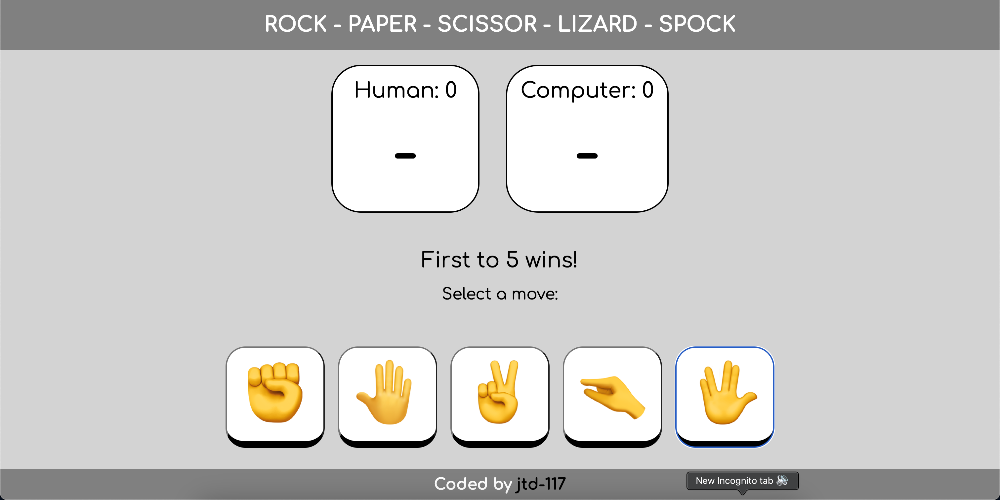
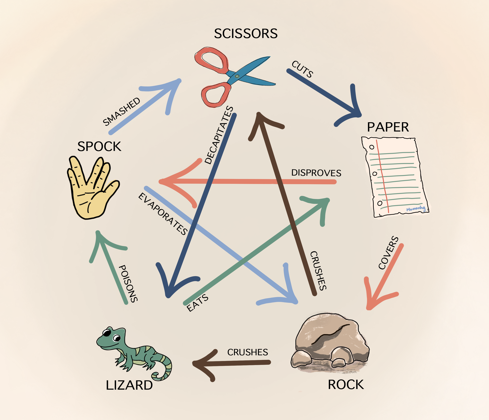

# ROCK, PAPER, SCIZZORS, LIZARDS, SPOCK (RPSLS)

## Contents:
1. [About](#about)
2. [Features](#features)
3. [Note](#note)

## About:
'Rock, Paper, Scizzors, Lizards, Spock' (RPSLS) is a parody of the game 'Rock, Paper, Scizzors' mentioned in the television show ['The Big Bang Theory'](https://en.wikipedia.org/wiki/The_Big_Bang_Theory). This project is a single player game that provides a user interface for players to play against a computer that randomly selects moves.

The rules of the game are as follows:

# Features:
- Responsive CSS design
- In-game audio cues & music stings
- An easy to use interface

## Note:
This repository is based off [project 3](https://www.theodinproject.com/lessons/foundations-rock-paper-scissors) of the 'Foundations Course' offered by ['The Odin Project'](https://www.theodinproject.com/). Find it under the 'JavaScript Basics' section.